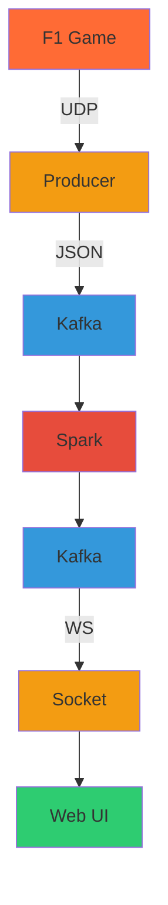

# 🏎️ F1 Telemetry Streaming Pipeline

F1 Telemetry is a comprehensive streaming data platform that captures, processes, and visualizes Formula 1 game telemetry data in real-time. The system provides windowed telemetry aggregations with interactive charts, perfect for analyzing racing performance and telemetry patterns.

## Architecture



### Technology Stack

| Component | Technology | Purpose |
|-----------|------------|---------|
| **UDP Parser** | Rust + tokio | High-performance packet parsing and Kafka publishing |
| **Message Broker** | Apache Kafka 3.9.1 | Distributed streaming platform with topic partitioning |
| **Stream Processing** | Apache Spark 3.5.6 | Real-time aggregation with tumbling windows |
| **WebSocket Server** | Rust + tokio-tungstenite | Live data streaming to browser clients |
| **Frontend** | Vue.js 3 + TypeScript | Interactive dashboard with Chart.js visualization |
| **Orchestration** | Docker Compose | Complete service lifecycle management |

## Quick Start

### Prerequisites

- **Docker** & **Docker Compose** - Container orchestration
- **Make** - Build automation (optional but recommended)

### Launch the Pipeline

```bash
# Clone the repository
git clone https://github.com/phish3y/f1-telemetry.git
cd f1-telemetry

# Start all services
make up
```

### Access the Dashboard

Open your browser and navigate to:
- **Web Dashboard**: http://localhost:80

## Data Flow

### 1. **UDP Ingestion** (`producer/`)
- Listens on port `20777` for F1 2025 telemetry packets
- Parses binary data using `bytemuck` for zero-copy deserialization
- Publishes structured JSON to Kafka topics with async channels

### 2. **Stream Processing** (`consumer/`)
- Consumes car telemetry data from Kafka
- Applies tumbling windows (3-second intervals) for telemetry aggregation
- Calculates statistical metrics and performance indicators with watermark handling
- Publishes aggregated results back to Kafka

### 3. **Real-time Streaming** (`socket/`)
- Consumes aggregated data from Kafka
- Broadcasts live updates via WebSocket to connected browsers
- Handles client connection management and reconnection

### 4. **Web Visualization** (`web/`)
- Vue.js 3 application with Chart.js integration
- Real-time telemetry charts with scrolling time-based visualization  
- Minimalistic 90's Windows aesthetic
- Responsive design supporting multiple chart layouts

## Development Setup

### Local Development Requirements

- **Rust/Cargo** (1.88.0+)
- **Scala** (2.12.18)
- **SBT** - Scala build tool
- **Node.js** (18+) - For frontend development
- **Docker** & **Docker Compose** - Container orchestration
- **Make** - Build automation (optional)

## License

This project is licensed under the **MIT License** - see the [LICENSE](LICENSE) file for details.
